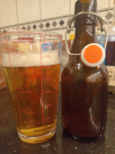

# Beer tasting day @ January 13th, 2023.

Tasted the second bottle of the wet hops Willamette Golden Ale.

Clear, very clear ... malty and a subtle presence of hops ...
look likes the hop taste fades away over time in this one.

