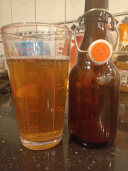

# Beer tasting day @ February 16th, 2023.

Tasted the first bottle of the SMaSH Godiva v2 Golden Ale.

Clear, very clear ... sweet, smooth, strong and a flavor of hops I just
can't put descriptors to.

Not resiny or piney ... a kind of sweetness that goes with berries, yet
I can't discern the advocated gooseberry or tangerine that the hop
farmers describe.

This one could use a bit more carbonation, may give it some time,
because it has been cold in the cellar these last weeks.

