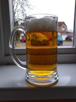

# The 11th Home Brewing UK competition

The target is Boddingtons as brewed 40 to 50 years ago in the
Strangeways Brewery before it went downhill.
Appearance was pale straw in colour with a good, lasting, creamy,
white head.
Aroma was straw/hay.
Taste was bitter, dry and very moreish.
A low OG of 1.035 and high attenuation gave the dryness yet the beer was
not thin!
Loads of threads on this beer both [here](https://www.homebrewinguk.com/post/boddingtons-recipe-8136454?highlight=boddington&pid=1309073875)
and elsewhere and a good background article here, but any questions ask.

Clibit has agreed to judge this so entries to him by the end of March. 

## Beer tasting by Clibit and second judge @ April 1st, 2023.

Tasted by Clibit@homebrewinguk.com

I've just supped a small bottle of Thirsty's Five Pints that he brought
all the way from the Neverneverlands.
I've been interested in brewing this and I now intend to get onto it.
I was quite confident the yeast must be liquid but it turns out to be
Lallemand London.
I think I've been partially fooled by the big Fuggles hopstand, about
3 g per litre after flameout, on top of kettle hops.
I read elsewhere that Fuggles does unexpected things in this recipe and
it sure does.
It's a much fruitier beer than I expected, and I mistook the fruitiness
for yeast esters.
Which shows how little I know, on the eve of the Bodds judging.

I do see people praising the London yeast, and I have had some good
beers with it.
Adrian had a very good comp entry once that used London, and his home
grown hops.
I noticed the yeast being good then.
It finished high but you can't tell from the taste.
I think Robert's Bodds entry is a London beer.
Look forward to that tomorrow, Rob's beers are always good.

[Final results](results.md)

## Some thoughts by judge Clibit
 
Boddingtons yeast must have been pretty clean but very highly attenuative.
1318 started very estery in my beer but has got pretty clean pretty quickly.
Ringwood is a very nice yeast, I prefer it to 1318 for this bitters, I think.
But I have been blown away by the dry yeast beers. I thought English bitter needed liquid yeast.
Notty, London/K97, S04/S33, Windsor held up very well against 1318, Ringwood and WLP007.
Notty got closest.
None of the beers were quite dry enough.
Historical recipe accuracy doesn't seem to be a major factor in reproducing Bodds!
Some were too fruity.
Some had too much hop flavour.
I think it's mostly bitterness with a smidge of dry hop that's wanted.
Some had too much crystal flavour.
Rob's was too pale, I think. Bodds wants a bit of colour and a flavour to match. 
Probably needs invert sugar for flavour/colour.
John added glycerine. Maybe Bodds yeast produced glycerine, as Belle Saison does.
Bodds didn't have huge malt, hop or yeast flavour, but wasn't bland!

## What would I try next myself? (by Clibit)

Pale, Invert, Maize, wheat. Maybe a touch of brown malt! Or black.
Bittering hops (BX and NB maybe) and Goldings dry hop
Notty, conditioned for a few weeks. And maybe follow it up late with a saison yeast?
Belle Saison maybe, once a lot of fermentation is done. - might add some glycerine.
Gypsum 

To be honest I'd be very happy drinking the competition entries.
I'm not fussed with trying to find the holy grail.
Pointless anyway.
I'll have a go at Rob and John's recipes and maybe others from the comp.
 
