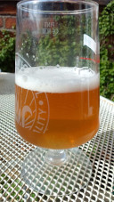

# More beer tasting by Clibit @ April 4th, 2023

Having done a bit of gardening I felt I deserved a glass of beer.
This is a beer delivered to my door from abroad by TTO, and it's a
Godiva Golden Ale. 
 
It's a really nice one.
It's well hopped which really suits me.
Bitterness is spot on.
Extremely refreshing.
My first thought was apricot and citrus, like Tangerine.
With a light spice.
The official Godiva description says white fruit (grapes), citrus and
herbal/floral.
I get the floral.
I don't have the recipe but I don't spot much if any crystal, maybe a
little pale crystal? i suspect 1044 ish? 35 IBU? Yeast? Verdant?
I could be miles out!! 
 
I'd be very happy if I'd made this.
A lovely beer for the sunshine.
I poured a bit of yeast, it was crystal clear prior til that last bit. 

