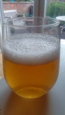

# More beer tasting by Clibit @ May 3rd, 2023

Tonight's treat is a bottle of Belgian Strong Ale, hand delivered from
the Low Countries by TTO.
I'm not an expert with this style by any stretch, I rarely drink big
beers of any kind.
But this is a treat, I'm very much enjoying it as a nice change.
It does remind me a bit of the Westmalle Tripel I had last year.
I detect no faults with it.
There's a big sweet pilsner malt base, the alcohol is a big influence,
in a good way - there's no fusels - and the yeast is how I like it in a
Belgian beer - not extreme phenolics, it makes for a very balanced beer.
I really do think you made a great job of this beer Thirsty, I would be
chuffed to have brewed this myself.
Cheers big man.

