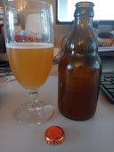

# Beer tasting day @ July 27th, 2023

My first raw ale brew.

Today I tasted one of the possible candidates for the comp, a Norwegian
style raw ale (kornøl) with Juniper berries.

Brewferm Pale Malt with a little bit of Saaz at the start of the no boil
(brought to 80 C for 10 minutes, dropped the hop pellets and let it cool
over night).
Fermented for 7 days with Lallemand Voss at 30 C.
Yeasty tarty aroma, with a malty flavor with hints of Juniper.
Not a sweet malt flavor but tart, almost like a sour or a witbier.
Low carbonation with good lacing and very small bubbles.
A bit cloudy because it was the last bottle to fill and I scrooged
again, so I had some of the cake as well.
All in all a nice ale for a new brew method to me.
