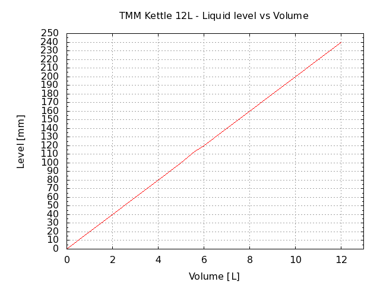

# [The Malt Miller 12 L brew pot](https://www.themaltmiller.co.uk/product/12-litre-stainless-steel-pot/)

12 litre stainless steel pot with lid suitable for conversion to a boiler or hot liquor tun.

Can be used with electric element, induction or on a gas ring.

<b>NOTE:</b>

Although these pots are not magnetic they can be used on induction hobs, however you’ll need at least a 3 kW hob for them.
We have tested and used successfully on a 3 kW Buffalo Hob.

Dimensions are 25 cm diameter x 25 cm height.

