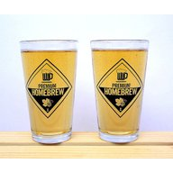

# 69 Two Pints and a Packet of Hops (Godiva and Progress)

## Recipe for a 5 L batch size.

|    | Style | ABV | IBU | EBC | pdf | BeerXML | JSON | Batches |
|----|-------|-----|-----|-----|-----|---------|------|---------|
| [v1](./83_Two_Pints_and_a_Packet_of_Hops_Godiva_and_East_Kent_Goldings.md) | British Golden Ale | 4.2 % | 33 | 8.3 | [pdf](./83_Two_Pints_and_a_Packet_of_Hops_Godiva_and_East_Kent_Goldings.pdf) | [BeerXML](./83_Two_Pints_and_a_Packet_of_Hops_Godiva_and_East_Kent_Goldings.xml) | [json](./83_Two_Pints_and_a_Packet_of_Hops_Godiva_and_East_Kent_Goldings.json) | [#29](../../batches/batch_29/README.md) |
