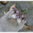
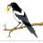

# Recipes

## Thirsty Otter recipes

|    | Recipe name | Style | ABV | IBU | Brewed |
|----|-------------|-------|-----|-----|--------|
|  | [01 AnOtter Witbier](01_AnOtter_Witbier/README.md) | Witbier (All Grain) | 4.9 % | 11 | |
|  | [02 AnOtter Spicy Witbier](02_AnOtter_Spicy_Witbier/README.md) | Witbier (All Grain) | 4.7 % | 11 | |
|  | [03 SMaSH Godiva](03_SMaSH_Godiva/README.md) | British Golden Ale (All Grain) | 4.7 % | 37 | Yes |
|  | [04 SMaSH Fuggle](04_SMaSH_Fuggle/README.md) | British Golden Ale (All Grain) | 4.3 % | 27 | Yes |
|  | [05 SMaSH Centennial](05_SMaSH_Centennial/README.md) | American Pale Ale (All Grain) | 5.4 % | 38 | Yes |
|  | [06 SMaSH Citra](06_SMaSH_Citra/README.md) | American Pale Ale (All Grain) | 6.0 % | 40 | Yes |
|  | [07 SMaSH Simcoe](07_SMaSH_Simcoe/README.md) | American Pale Ale (All Grain) | 6.0 % | 39 | Yes |
|  | [08 SMaSH Magnum](08_SMaSH_Magnum/README.md) | Blonde Ale (All Grain) | 4.7 % | 23 | Yes |
|  | [09 SMaSH Sabro](09_SMaSH_Sabro/README.md) | Specialty IPA (All Grain) | 6.6 % | 75 | Yes |
|  | [10 SMaSH CF184](10_SMaSH_CF184/README.md) | British Golden Ale (All Grain) | 4.3 % | 33 | No |
|  | [11 SMaSH Progress](11_SMaSH_Progress/README.md) | British Golden Ale (All Grain) | 4.3 % | 38 | No |
|  | [12 SMaSH Boadicea](12_SMaSH_Boadicea/README.md) | British Golden Ale (All Grain) | 4.5 % | 29 | No |
|  | [13 SMaSH East Kent Golding](13_SMaSH_East_Kent_Golding/README.md) | British Golden Ale (All Grain) | 4.5 % | 26 | No |
|  | [14 SMaSH Apollo](14_SMaSH_Apollo/README.md) | American Pale Ale (All Grain) | 5.1 % | 31| No |
|  | [15 SMaSH Nelson Sauvin](15_SMaSH_Nelson_Sauvin/README.md) | American Pale Ale (All Grain) | 4.9 % | 31 | No |
|  | [16 SMaSH Lotus](16_SMaSH_Lotus/README.md) | American Pale Ale (All Grain) | 5.6 % | 41 | No |
|  | [17 SMaSH Lemondrop](17_SMaSH_Lemondrop/README.md) | Blonde Ale (All Grain) | 4.9 % | 21 | No |
|  | [18 SMaSH Talus](18_SMaSH_Talus/README.md) | Blonde Ale (All Grain) | 4.7 % | 18 | No |
|  | [19 SMaSH Mosaic](19_SMaSH_Mosaic/README.md) | American Wheat Beer (All Grain) | 4.6 % | 21 | No |
|  | [20 SMaSH Galaxy](20_SMaSH_Galaxy/README.md) | American Pale Ale (All Grain) | 6.2 % | 44 | No |
|  | [21 SMaSH First Gold](21_SMaSH_First_Gold/README.md) | British Golden Ale (All Grain) | 4.3 % | 35 | No |
|  | [22 SMaSH Palisade](22_SMaSH_Palisade/README.md) | Blonde Ale (All Grain) | 4.6 % | 23 | No |
|  | [30 Reynard](30_Reynard/README.md) | Irish Read Ale (All Grain) | 4.5 % | 25 | No |
|  | [31 Isengrim](31_Isengrim/README.md) | Oatmeal Stout (All Grain) | 4.7 % | 31 | No |
|  | [48 AnOtter Apple Cider](48_AnOtter_Apple_Cider/README.md) | English Cider (Extract) | 6.3 % | 0 | Yes |
|  | [49 AnOtter Perry Cider](49_AnOtter_Perry_Cider/README.md) | New World Perry (Extract) | 6.3 % | 0 | Yes |
|  | [59 Four Hops IPA](59_Four_Hops_IPA/README.md) | Specialty IPA (All Grain) | 6.6 % | 69 | No |
|  | [61 Three Hops Blonde](61_Three_Hops_Blonde/README.md) | Blonde Ale (All Grain) | 4.7 % | 23 | Yes |
|  | [65 Juniper Ascending](65_Juniper_Ascending/README.md) | Kornol (All Grain) | 6.4 % | 7 | Yes |
|  | [66 Kornol](66_Kornol/README.md) | Kornol (All Grain) | 6.4 % | 7 | No |
|  | [68 Two Pints and a Packet of Hops (Fuggle and East Kent Goldings)](68_Two_Pints_and_a_Packet_of_Hops_Fuggle_and_East_Kent_Goldings/README.md) | Best Bitter (All Grain) | 4.5 % | 29 | Yes |
|  | [69 Two Pints and a Packet of Hops (Godiva and Progress)](69_Two_Pints_and_a_Packet_of_Hops_Godiva_and_Progress/README.md) | British Golden Ale (All Grain) | 4.3 % | 32 | Yes |
|  | [74 Wet Hops Blonde Ale](74_Wet_Hops_Blonde_Ale/README.md) | Blonde Ale (All Grain)| 4.3 | 22 | Yes |
|  | [75 Shameless Magpied Summer Ale](75_Shameless_Magpied_Summer_Ale/README.md) | Blonde Ale (All Grain)| 4.6 | 24 | Yes |
|  | [77 Five Pints of Best Fuggles](77_Five_Pints_of_Best_Fuggles/README.md) | Best Bitter (All Grain) | 4.1 % | 29 | Yes |
| | [A2 AnOtter Bodged Bitter](A2_AnOtter_Bodged_Bitter/README.md) | Ordinary Bitter (All Grain | 4.1 % | 32 | Yes |

## Brew kit recipes

|    | Recipe name | Style | ABV | IBU | Brewed |
|----|-------------|-------|-----|-----|--------|
|  | [Brouwpunt - Witbier](Brouwpunt_Witbier/README.md) | Witbier (All Grain) | 4.9 % | 11 | Yes |
|  | [Brouwpunt - Kruidig Wit](Brouwpunt_Kruidig_Wit/README.md) | Witbier (All Grain) | 4.9 % | 11 | Yes |
|  | [Brouwpunt - Sinterklaas Special](Brouwpunt_Sinterklaas_Special/README.md) | Autumn Seasonal Beer (All Grain) | 6.4 % | 21 | Yes |

## Clone recipes

|    | Recipe name | Style | ABV | IBU |
|----|-------------|-------|-----|-----|
|  | [Five Points Brewing - Best Fuggles (clone)](Five_Points_Brewing_Best_Fuggles_clone/README.md) | Best Bitter (All Grain) | 4.1 % | 29 |
|  | [Shambles Brewery - Summer Ale Afternoon Delight (clone)](Shambles_Brewery_Summer_Ale_Afternoon_Delight_clone/README.md) | Blonde Ale (All Grain) | 4.6 % | 24 |
