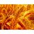
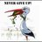
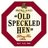
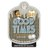

# Recipes

## Getting started recipes

|                     | Recipe name | Style | ABV | IBU |
|---------------------|-------------|-------|-----|-----|
|  | [01 Brouwpunt - Witbier](01_Brouwpunt_Witbier/README.md) | Witbier (AG) | 4.9 % | 11 | 
|  | [02 Brouwpunt - Kruidig Wit](02_Brouwpunt_Kruidig_Wit/README.md) | Witbier (AG) | 4.9 % | 11 |

## Thirsty Otter recipes

|                     | Recipe name | Style | ABV | IBU |
|---------------------|-------------|-------|-----|-----|
|  | [03 SMaSH Godiva](03_SMaSH_Godiva/README.md) | British Golden Ale (AG) | 4.7 % | 37 |
|  | [04 SMaSH Fuggle](04_SMaSH_Fuggle/README.md) | British Golden Ale (AG) | 4.2 % | 33 |
|  | [05 SMaSH Centennial](05_SMaSH_Centennial/README.md) | American Pale Ale (AG) | 5.3 % | 39 |
|  | [06 SMaSH Citra](06_SMaSH_Citra/README.md) | American Pale Ale (AG) | 5.9 % | 43 |
|  | [07 Make America Amber Again](07_Make_America_Amber_Again/README.md) | American Amber Ale (AG) | 5.3 % | 32 |
|  | [08 Orange Wheat IPA](08_Orange_Wheat_IPA/README.md) | American Wheat Beer (AG) | 5.1 % | 32 |
|  | [09_American Wheat Beer](09_American_Wheat_Beer/README.md) | American Wheat Beer (AG) | 4.7 % | 24 |
|  | [10 Brexit ESB](10_Brexit_ESB/README.md) | Strong Bitter (AG) | 5.4 % | 44 |
|  | [11 Ich Weiss Es Nicht](11_Ich_Weiss_Es_Nicht/README.md) | Weissbier (AG) | 5.5 % | 13 |
|  | [12 SMaSH Simcoe](12_SMaSH_Simcoe/README.md) | American Pale Ale (AG) | 6.0 % | 41 |
|  | [13 Isengrim](13_Isengrim/README.md) | Oatmeal Stout (AG) | 5.5 % | 28 |
|  | [14 Reynard](14_Reynard/README.md) | Irish Red Ale (AG) | 4.5 % | 26 |
|  | [15 Never Give Up](15_Never_Give_Up/README.md) | Belgian Golden Strong Ale (AG) | 9.1 % | 28 |
|  | [16 SMaSH Magnum](16_SMaSH_Magnum/README.md) | Blonde Ale (AG) | 4.6 % | 23 |
|  | [17 SMaSH Sabro](17_SMaSH_Sabro/README.md) | Specialty IPA (AG) | 6.4 % | 80 |
|  | [18 SMaSH East Kent Golding](18_SMaSH_East_Kent_Golding/README.md) | British Golden Ale (AG) | 4.5 % | 29 |

## Clone recipes

|                     | Recipe name | Style | ABV | IBU |
|---------------------|-------------|-------|-----|-----|
|  | [C01 Five Points Brewing - Best Fuggles (clone)](C01_Five_Points_Brewing_Best_Fuggles_clone/README.md) | Best Bitter (AG) | 4.3 % | 33 |
|  | [C02 Five Points Brewing - Best Goldings (clone)](C02_Five_Points_Brewing_Best_Goldings_clone/README.md) | Best Bitter (AG) | 4.2 % | 36 |
|  | [C03 St Austell - Tribute (clone)](C03_St_Austell_Tribute_clone/README.md) | British Golden Ale (AG) | 4.5 % | 30 |
|  | [C04 Shepherd Neame - Spitfire Amber Kentish Ale (clone)](C04_Shepherd_Neame_Spitfire_Amber_Kentish_Ale_clone/README.md) | Best Bitter (AG) | 4.6 % | 36 |
|  | [C05 Shepherd Neame - Master Brew (clone)](C05_Shepherd_Neame_Master_Brew_clone/README.md) | Best Bitter (AG) | 4.2 % | 26 |
|  | [C06 Harvey's - Sussex Best Bitter (clone)](C06_Harveys_Sussex_Best_Bitter_clone/README.md) | Best Bitter (AG) | 4.1 % | 35 |
|  | [C07 Greene King - Morland Old Speckled Hen (clone)](C07_Greene_King_Morland_Old_Speckled_Hen_clone/README.md) | Strong Bitter (AG) | 5.1 % | 40 |
|  | [C08 Timothy Taylor's - Landlord (clone)](C08_Timothy_Taylors_Landlord_clone/README.md) | Classic English-style Pale Ale (AG) | 4.1/4.3 % | 36 |
|  | [C09 Fuller's Brewery - London Pride (clone)](C09_Fullers_Brewery_London_Pride_clone/README.md) | Best Bitter (AG) | 4.3 % | 31 |
|  | [C10 St Austell - Proper Job (clone)](C10_St_Austell_Proper_Job_clone/README.md) | English IPA | 5.8 % | 10 |
|  | [C55 Williams Brothers Brewing Co. - Good Times (clone)](C55_Williams_Brothers_Brewing_Co._Good_Times_clone/README.md) | British Golden Ale (AG) | 5 % | 18 |

