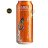

# Recipes

## Thirsty Otter recipes

|    | Recipe name | Style | ABV | IBU |
|----|-------------|-------|-----|-----|
|  | [01 AnOtter Witbier](01_AnOtter_Witbier/README.md) | Witbier (All Grain) | 5.0 % | 11 | 
|  | [02 AnOtter Spicy Witbier](02_AnOtter_Spicy_Witbier/README.md) | Witbier (All Grain) | 4.7 % | 11 |
|  | [03 SMaSH Godiva](03_SMaSH_Godiva/README.md) | British Golden Ale (All Grain) | 4.7 % | 37 |
|  | [04 SMaSH Fuggle](04_SMaSH_Fuggle/README.md) | British Golden Ale (All Grain) | 4.3 % | 27 |
|  | [05 SMaSH Centennial](05_SMaSH_Centennial/README.md) | American Pale Ale (All Grain) | 5.4 % | 38 |
|  | [06 SMaSH Citra](06_SMaSH_Citra/README.md) | American Pale Ale (All Grain) | 6.0 % | 40 |
|  | [07 SMaSH Simcoe](07_SMaSH_Simcoe/README.md) | American Pale Ale (All Grain) | 6.0 % | 39 |
|  | [08 SMaSH Magnum](08_SMaSH_Magnum/README.md) | Blonde Ale (All Grain) | 4.7 % | 23 |
|  | [09 SMaSH Sabro](09_SMaSH_Sabro/README.md) | Specialty IPA (All Grain) | 6.6 % | 75 |
|  | [10 SMaSH CF184](10_SMaSH_CF184/README.md) | British Golden Ale (All Grain) | 4.3 % | 33 |

## Brew kit recipes

|    | Recipe name | Style | ABV | IBU |
|----|-------------|-------|-----|-----|
|  | [Brouwpunt - Witbier](Brouwpunt_Witbier/README.md) | Witbier (All Grain) | 4.9 % | 11 | 
|  | [Brouwpunt - Kruidig Wit](Brouwpunt_Kruidig_Wit/README.md) | Witbier (All Grain) | 4.9 % | 11 |
|  | [Brouwpunt - Sinterklaas Special](Brouwpunt_Sinterklaas_Special/README.md) | Autumn Seasonal Beer (All Grain) | 6.4 % | 21 |

## Clone recipes

|    | Recipe name | Style | ABV | IBU |
|----|-------------|-------|-----|-----|
|  | [Five Points Brewing - Best Fuggles (clone)](Five_Points_Brewing_Best_Fuggles_clone/README.md) | Best Bitter (All Grain) | 4.1 % | 29 |
|  | [Shambles Brewery - Summer Ale Afternoon Delight (clone)](Shambles_Brewery_Summer_Ale_Afternoon_Delight_clone/README.md) | Blonde Ale (All Grain) | 4.6 % | 24 |
